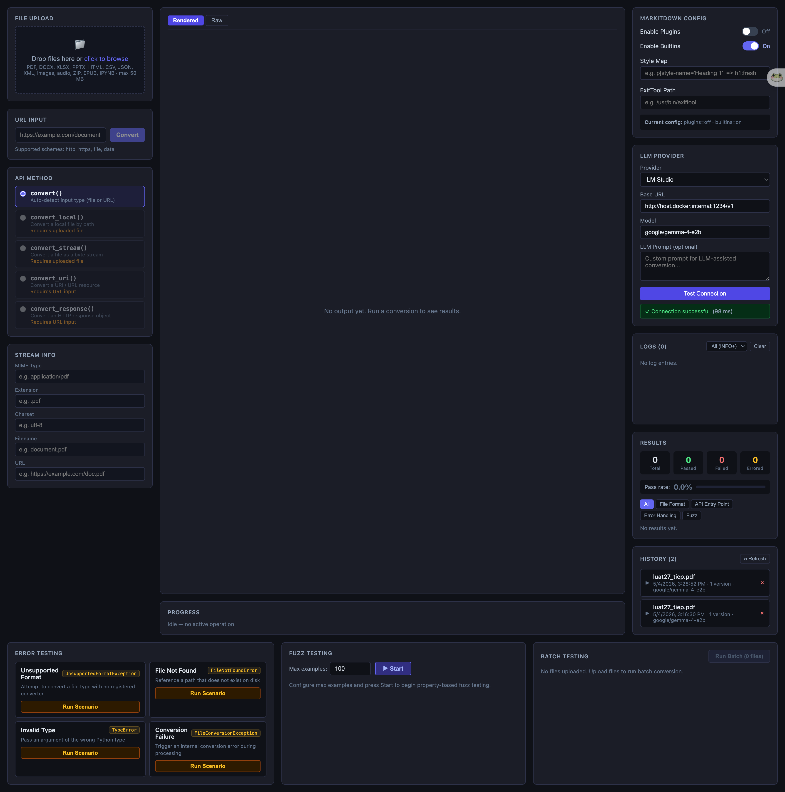
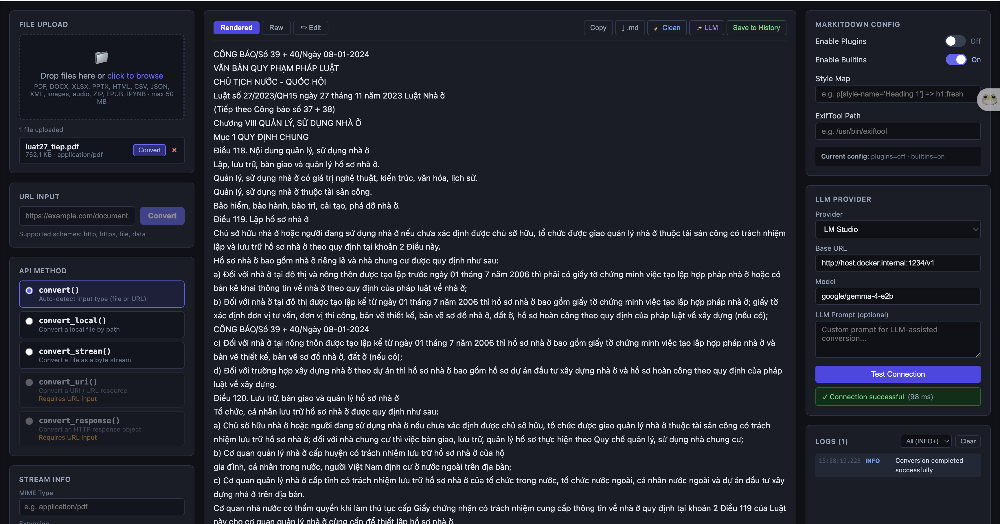

# MarkItDown Test UI

A full-stack web application for testing and exploring [Microsoft's MarkItDown](https://github.com/microsoft/markitdown) Python library. It provides an interactive dashboard to exercise all five of MarkItDown's conversion entry points, configure LLM providers, run error scenarios, execute Hypothesis-based fuzz tests, process files in batch, and post-process output with regex or LLM cleanup — all with real-time progress updates via WebSocket.

## Screenshots





## Features

- **File upload** — drag-and-drop or click-to-browse, supports 20+ file formats up to 50 MB
- **URL conversion** — convert any http/https/file/data URL, with YouTube URL detection
- **API method selection** — choose between `convert`, `convert_local`, `convert_stream`, `convert_uri`, or `convert_response`
- **StreamInfo configuration** — set mimetype, extension, charset, filename, and URL hints for stream-based conversions
- **LLM provider support** — configure OpenAI, Azure OpenAI, Google Gemini, Ollama, LM Studio, Together AI, Groq, or a custom OpenAI-compatible endpoint; includes connection testing
- **Post-processing** — regex-based cleanup (page numbers, OCR artifacts, broken lines) and LLM-powered Markdown restructuring
- **Conversion history** — SQLite-backed document and version tracking with notes, labels, and metadata; full CRUD via REST API
- **Persisted settings** — UI preferences and non-sensitive config saved to SQLite (API keys are never stored)
- **Error scenario testing** — trigger predefined error conditions (`unsupported_format`, `file_not_found`, `invalid_type`, `conversion_failure`) and verify exception handling
- **Fuzz testing** — run Hypothesis property-based tests server-side with live progress and minimal failing input display
- **Batch testing** — convert multiple uploaded files in one operation with per-file results and progress tracking
- **Structured logging** — timestamped, severity-filtered log display with auto-scroll
- **Output viewer** — rendered Markdown preview and raw syntax-highlighted source, with copy and download options
- **Real-time WebSocket** — all conversion, batch, fuzz, error-test, and LLM-cleanup actions stream progress and results over a single `/ws/test` connection

## Supported File Formats

`.pdf` `.docx` `.xlsx` `.xls` `.pptx` `.html` `.csv` `.json` `.xml` `.jpg` `.jpeg` `.png` `.gif` `.bmp` `.tiff` `.mp3` `.wav` `.zip` `.epub` `.ipynb`

## Prerequisites

**Option A — Docker (recommended)**
- [Docker](https://docs.docker.com/get-docker/) 24+
- [Docker Compose](https://docs.docker.com/compose/install/) v2+

**Option B — Local development**
- Python 3.12+
- Node.js 20+

## Quick Start with Docker Compose

```bash
# 1. Copy the environment template
cp .env.example .env

# 2. (Optional) Edit .env to add API keys for LLM providers

# 3. Build and start both services
docker-compose up --build

# 4. Open the dashboard
#    http://localhost:3000
```

The backend API is also directly accessible at `http://localhost:8000` (FastAPI docs at `http://localhost:8000/docs`).

To stop:

```bash
docker-compose down
```

## Development Setup

### Backend

```bash
cd backend
pip install -e .
uvicorn app.main:app --reload
```

The API will be available at `http://localhost:8000`.

### Frontend

In a separate terminal:

```bash
cd frontend
npm install
npm run dev
```

The dev server will be available at `http://localhost:5173` and proxies `/api/` and `/ws/` requests to the backend.

### Running Tests

```bash
# Backend tests (pytest + Hypothesis)
cd backend
pytest

# Frontend tests (Vitest + fast-check)
cd frontend
npm test
```

## API Reference

### REST Endpoints

| Method | Path | Description |
|--------|------|-------------|
| `POST` | `/api/upload` | Upload a single file |
| `POST` | `/api/upload/batch` | Upload multiple files |
| `DELETE` | `/api/upload/{file_id}` | Delete an uploaded file |
| `POST` | `/api/convert` | Convert an uploaded file (sync) |
| `POST` | `/api/convert/url` | Convert a URL (sync) |
| `POST` | `/api/llm/test-connection` | Test LLM provider connectivity |
| `POST` | `/api/postprocess/clean` | Regex-based Markdown cleanup |
| `POST` | `/api/history/save` | Create a document + first version |
| `GET` | `/api/history/documents` | List documents (paginated) |
| `GET` | `/api/history/documents/{id}` | Get a single document |
| `PATCH` | `/api/history/documents/{id}/notes` | Update document notes |
| `DELETE` | `/api/history/documents/{id}` | Delete a document |
| `GET` | `/api/history/documents/{id}/versions` | List versions for a document |
| `POST` | `/api/history/documents/{id}/versions` | Add a new version |
| `GET` | `/api/history/versions/{id}` | Get a single version |
| `PATCH` | `/api/history/versions/{id}` | Update version content |
| `DELETE` | `/api/history/versions/{id}` | Delete a version |
| `GET` | `/api/settings` | Load persisted UI settings |
| `POST` | `/api/settings` | Save UI settings |
| `GET` | `/api/config/defaults` | Get default LLM endpoint URLs |
| `GET` | `/api/health` | Health check (status, markitdown version, uptime) |

### WebSocket

Connect to `/ws/test` for real-time operations. Send JSON messages with `{ "action": "...", "payload": { ... } }`.

| Action | Description |
|--------|-------------|
| `convert` | Convert an uploaded file with progress streaming |
| `convert_url` | Convert a URL with progress streaming |
| `batch` | Batch-convert multiple files with per-file progress |
| `fuzz_start` | Start Hypothesis fuzz testing |
| `fuzz_stop` | Stop a running fuzz session |
| `error_test` | Run a predefined error scenario |
| `llm_cleanup` | Post-process Markdown via LLM |

## Environment Variables

Copy `.env.example` to `.env` and fill in values as needed.

| Variable | Default | Description |
|---|---|---|
| `UPLOAD_MAX_SIZE_MB` | `50` | Maximum allowed file upload size in megabytes |
| `UPLOAD_DIR` | `/tmp/markitdown_uploads` | Directory where uploaded files are temporarily stored |
| `EXIFTOOL_PATH` | _(empty)_ | Path to the `exiftool` binary; leave empty to use the system default |
| `LM_STUDIO_BASE_URL` | `http://host.docker.internal:1234/v1` | LM Studio API endpoint |
| `OLLAMA_BASE_URL` | `http://host.docker.internal:11434/v1` | Ollama API endpoint |
| `OPENAI_API_KEY` | _(empty)_ | API key for OpenAI |
| `AZURE_OPENAI_API_KEY` | _(empty)_ | API key for Azure OpenAI Service |
| `GOOGLE_API_KEY` | _(empty)_ | API key for Google Gemini |
| `TOGETHER_API_KEY` | _(empty)_ | API key for Together AI |
| `GROQ_API_KEY` | _(empty)_ | API key for Groq |

Ollama and LM Studio use local endpoints and do not require API keys. In Docker, use `host.docker.internal` to reach services on the host machine.

## Architecture

```
Browser → http://localhost:3000
│
│  React / TypeScript SPA (Vite)
│  ├── REST calls  →  /api/*
│  └── WebSocket   →  /ws/test
│
nginx reverse proxy (port 80 inside frontend container)
│
FastAPI backend (Python 3.12, port 8000)
├── REST routes
│   ├── /api/upload, /api/upload/batch     — file management
│   ├── /api/convert, /api/convert/url     — synchronous conversion
│   ├── /api/llm/test-connection           — LLM connectivity check
│   ├── /api/postprocess/clean             — regex cleanup
│   ├── /api/history/*                     — document & version CRUD
│   ├── /api/settings                      — persisted UI config
│   └── /api/health                        — health check
├── WebSocket handler: /ws/test
├── TestRunner  — wraps MarkItDown conversion methods
├── FuzzRunner  — runs Hypothesis tests in a background thread
├── LLMFactory  — builds openai.OpenAI clients per provider
├── PostprocessService — regex + LLM Markdown cleanup
├── HistoryService — SQLite-backed document/version persistence
├── ConfigManager — environment-based configuration
└── LogService  — structured per-session log entries
│
MarkItDown library (markitdown[all])
```

| Layer | Technology |
|---|---|
| Frontend | React 18, TypeScript, Vite, react-markdown, remark-gfm, react-syntax-highlighter |
| Backend | FastAPI, Uvicorn, Pydantic v2, Python 3.12 |
| Library | markitdown[all] (Microsoft), PyMuPDF |
| LLM Client | openai SDK (supports OpenAI, Azure, and compatible endpoints) |
| Database | SQLite (WAL mode) for history and settings |
| Fuzz testing | Hypothesis (server-side) + fast-check (frontend) |
| Reverse proxy | nginx (inside the frontend container) |
| Orchestration | Docker Compose v2 |
